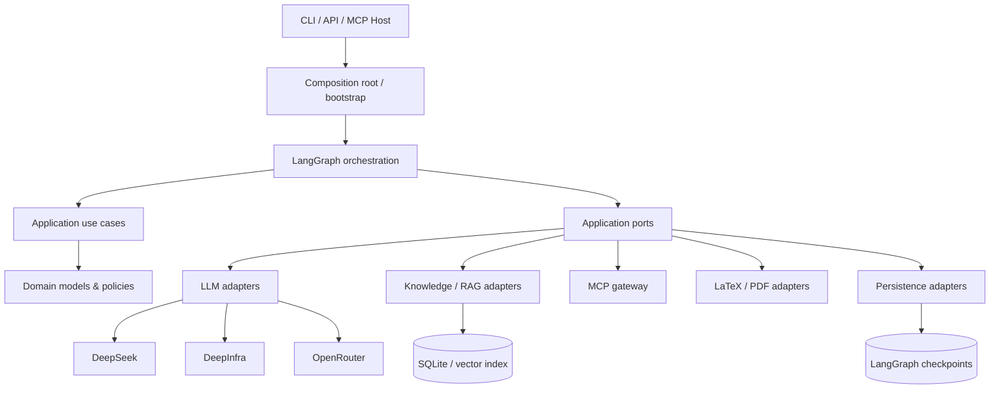
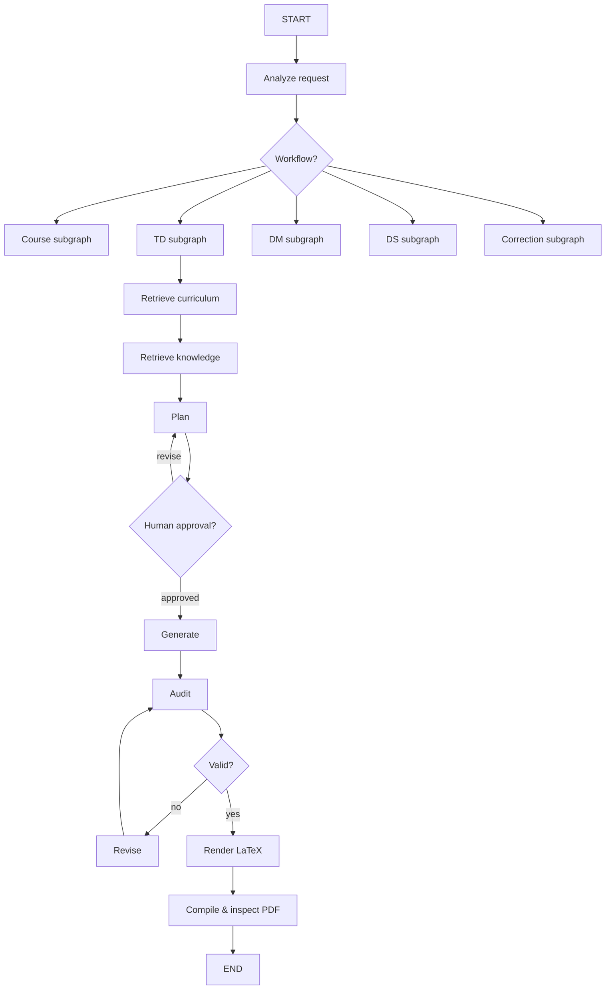

# Hermes Edu

> **Status: mathematics TD and course workflows, with a personal PDF reference library.** Other document workflows remain architecture placeholders.

## v0.1 quickstart

```bash
uv sync --all-extras --all-groups
cp -n .env.example .env
# Set DEEPSEEK_API_KEY and a valid HERMES_DEFAULT_MODEL in .env for live generation.
# Keep HERMES_EMBEDDING_PROVIDER=deterministic for offline local retrieval.
uv run hermes-edu doctor
uv run hermes-edu ingest --example
uv run hermes-edu td "Reduction" --curriculum sample-mp --track MP --exercises 3
# Use the printed thread ID after reviewing the plan:
uv run hermes-edu resume THREAD_ID approve
```

`--yes` on `td` explicitly skips plan approval. `--tex-only` produces TeX without XeLaTeX; use the same flag on `resume` when resuming such a run. PDF output requires XeLaTeX/TeX Live. Generated artifacts are stored under `workspace/THREAD_ID/`; checkpoints are under `.local/`. The bundled curriculum is synthetic and is **not** an official source. Real generation needs a configured DeepSeek credential; the test suite uses offline fakes.

Use `uv run hermes-edu ingest PATH --source-id ID --title TITLE --license LICENSE --curriculum CURRICULUM --track TRACK --kind curriculum` for a local source inside `HERMES_DATA_DIR`. `--kind knowledge` indexes supplemental notes. The MCP v2 stdio entry point is `uv run hermes-edu-mcp`; it exposes bounded search, validation, compilation, the synthetic curriculum, the TD template, and a TD prompt.

See [v0.1 operation and cost strategy](docs/operations-v01.md) for usage accounting, limits, and security choices.

## Utiliser Hermes en chat

Hermes peut aussi être piloté en langage naturel sans créer un second moteur :

```bash
uv run hermes-edu chat
uv run hermes-edu chat --project ensam-analyse1
uv run hermes-edu chat --resume last
uv run hermes-edu prompt "Prépare un TD sur les intégrales pour CP1 ENSAM, 10 exercices avec corrigé."
uv run hermes-edu prompt --file prompt.md
```

Le chat maintient une session structurée dans `.hermes/sessions/` (configurable avec `HERMES_CHAT_SESSIONS_DIR`). Il utilise un Helper Agent LLM rapide et peu coûteux comme orchestrateur conversationnel : il comprend la demande, maintient un résumé compact, met à jour `TaskDraft`, sélectionne quelques tools pertinents via `ToolRouter`, exploite leurs observations compactes, pose une question concise si nécessaire ou délègue aux workflows Hermes existants. Les commandes internes utiles sont `/help`, `/status`, `/plan`, `/sources`, `/add <path>`, `/run`, `/cancel`, `/new`, `/save` et `/exit`; elles restent déterministes et n'appellent pas le LLM.

Le Helper Agent n'est pas un chatbot généraliste et ne remplace pas les services métier. Les tools exécutent réellement les actions, la bibliothèque de références conserve hash/registre/parsing/chunking/embeddings/HNSW, les générateurs spécialisés produisent les documents, les validators contrôlent et le quality gate décide de la publication. Le modèle helper est configurable séparément :

```bash
HERMES_AGENT_ENABLED=true
HERMES_HELPER_PROVIDER=deepinfra
HERMES_HELPER_MODEL=<configured-fast-model>
HERMES_AGENT_MAX_STEPS=12
```

DeepSeek Flash ou tout modèle compatible avec les providers existants peut être utilisé sans le coder en dur dans l'application.

## Browser Tool

Hermes peut piloter un vrai Chromium comme tool général derrière un `BrowserPort`
applicatif et un adapter `PlaywrightBrowserAdapter`.

```bash
uv sync --extra browser --all-groups
uv run playwright install chromium
uv run hermes-edu chat --browser
uv run hermes-edu chat --browser-visible
uv run hermes-edu browser open https://example.com
```

Dans le chat : “ouvre https://…”, “lis la page”, “clique e2”, “descends”,
“télécharge e5 ajoute”. Les observations restent compactes : URL, titre, texte
visible borné et éléments interactifs `e1`, `e2`, etc. Les téléchargements sont
stockés sous `.hermes/browser/sessions/<session-id>/downloads/`; les PDF peuvent
ensuite être transmis à la bibliothèque existante, sans pipeline RAG séparé.

## Mode conversationnel

Les commandes structurées restent disponibles, mais Hermes peut aussi partir d'un prompt libre ou d'une session interactive :

```bash
uv run hermes-edu course "Intégrales" --curriculum sample-mp --track MP
uv run hermes-edu prompt "Prépare un cours sur les intégrales pour Analyse 1"
uv run hermes-edu chat
uv run hermes-edu chat --project ensam-analyse1
uv run hermes-edu chat --resume last
```

`chat` et `prompt` ne créent pas un second moteur : ils alimentent le même `ChatService`, construisent un brouillon structuré, vérifient les références avec la bibliothèque PDF/HNSW existante, puis appellent les workflows Hermes normaux. Les commandes internes minimales sont `/help`, `/status`, `/plan`, `/sources`, `/add <path>`, `/run`, `/cancel`, `/new`, `/save` et `/exit`. Une couverture insuffisante devient une question de workflow demandant une référence supplémentaire ; elle n'est jamais injectée dans le document étudiant.

## Créer un cours

Le contenu doit être fondé sur les passages retrouvés : ne pas inventer de théorèmes, preuves ou exemples pour combler une référence manquante. Une source insuffisante est traitée comme un événement de workflow et un `quality_report`, pas comme une phrase insérée dans le cours élève. L’audit contrôle la fidélité aux références ; les listes de repli configurées s'appliquent aussi à la vérification après correction.

Indexer le programme officiel avec `ingest --kind curriculum --curriculum ID --source-url URL`, puis ajouter les PDF de cours à la bibliothèque. `uv run hermes-edu course "Intégrales dépendant d'un paramètre" --curriculum mp-maroc --track MP --sections 6` retrouve la partie officielle, en extrait un plan sourcé, puis utilise chaque titre et sa sous-partie officielle pour rechercher les passages de cours nécessaires à la rédaction. Chaque section est ensuite auditée avec ses références, puis le quality gate produit `quality_report.json` et `quality_report.md`. Reprendre avec `uv run hermes-edu course-resume THREAD_ID approve` ; `--yes` sur `course` lance directement le workflow. Voir [les instructions et limites](docs/courses.md). Les tâches peuvent définir jusqu'à quatre modèles de repli ordonnés et distincts : erreur, délai ou JSON invalide passe au candidat suivant sans modifier l'ordre configuré. Les métriques locales sans contenu sont dans `.local/llm-metrics.db`.

## Ajouter mes références

Placez vos PDF dans `data/`, puis utilisez `uv run hermes-edu references add data/mon-cours.pdf` ou `uv run hermes-edu references add-directory data/mes-cours`. Hermès prépare chaque contenu une fois et le conserve pour les recherches suivantes, même si le fichier est renommé. `uv run hermes-edu references list` affiche la bibliothèque et `uv run hermes-edu references search "espaces vectoriels" --top-k 5` recherche les passages utiles. Une bibliothèque vide et une recherche sans source pertinente sont signalées séparément ; vous pouvez alors ajouter un PDF et relancer la même question.

Pour les références réelles, configurez `HERMES_EMBEDDING_PROVIDER=deepinfra`, `HERMES_EMBEDDING_MODEL=Qwen/Qwen3-Embedding-8B` et `DEEPINFRA_API_KEY` dans `.env`. Avec le mode par défaut `HERMES_REFERENCE_PDF_MODE=latex`, chaque nouveau PDF est converti en LaTeX par iLoveMyLaTeX avant le chunking ; `ILOVEMYLATEX_API_KEY` est nécessaire. Le LaTeX obtenu est conservé avec les artefacts de parsing pour les réutilisations suivantes. Le mode `text` reste un choix explicite pour les tests hors ligne ; il n'est jamais utilisé en secours silencieux d'une conversion échouée.

Développeurs : le pipeline est dans `knowledge/ingestion/structured_pdf.py` (parser), `knowledge/chunking/semantic.py` (objets mathématiques), `application/use_cases/reference_library.py` (use case), `persistence/repositories/sqlite.py` (registre/artefacts) et `knowledge/stores/hnsw.py` (index natif HNSW persistant). Le câblage et les paramètres sont dans `bootstrap.py` et `config/settings.py`. Un autre parser ou fournisseur d'embeddings s'ajoute derrière les ports existants. La migration SQLite `0001_reference_library.sql` s'applique automatiquement au premier accès à la bibliothèque ; elle conserve les tables TD existantes. Aucune instance Qdrant n'est nécessaire. `uv run hermes-edu references reindex DOCUMENT_ID` force le recalcul ; `make lint typecheck test build` valide le dépôt.

Hermes Edu is an open-source educational agent architecture designed to create and maintain high-quality **courses, exercise sheets/TDs, homework/DMs, tests/DSs, corrections, explanations, and LaTeX/PDF documents**. The initial domain is mathematics, but the architecture is intentionally provider- and curriculum-agnostic.

The project is designed around four ideas:

1. **Clean Architecture / ports & adapters** so the educational core does not depend on DeepSeek, OpenRouter, SQLite, MCP, LangGraph, or a web framework.
2. **LangGraph for orchestration** of stateful, long-running workflows: routing, revision loops, checkpoints, human approval, and subgraphs.
3. **MCP Python SDK v2 as a standardized boundary** for tools, resources, and prompts — not as the business core.
4. **RAG as an independent knowledge subsystem** so curricula, courses, exercise banks, and references can be indexed and retrieved without coupling retrieval to the LLM provider.

---

## 1. What Hermes Edu should eventually do

A user should be able to ask naturally:

```text
Create an MP-level TD on reduction, 8 progressive exercises,
with a detailed correction, following the official curriculum,
and generate the final PDF.
```

The system should then execute a controlled workflow:

```text
request
  ↓
understand intent and educational context
  ↓
select workflow (course / TD / DM / DS / correction / explanation)
  ↓
retrieve official curriculum + relevant knowledge
  ↓
plan document
  ↓
human approval when configured
  ↓
generate draft
  ↓
audit mathematics + curriculum + pedagogy
  ↓
revise until valid or retry limit reached
  ↓
render LaTeX
  ↓
compile + inspect PDF
  ↓
return artifacts
```

The LLM is never the only authority. Deterministic checks, retrieval provenance, tool validation, and human approval remain part of the workflow.

---

## 2. Architecture in one diagram



### Dependency direction

The dependency rule is more important than the folder names:

```text
interfaces / orchestration / adapters
              ↓
          application
              ↓
            domain
```

`domain/` must remain framework-independent. Infrastructure implements **ports** defined by the application layer.

---

## 3. Why LangGraph?

Hermes is not just a single prompt. A reliable educational document workflow needs:

- shared state;
- deterministic and LLM nodes;
- conditional routing;
- generation → audit → correction loops;
- bounded retries;
- checkpoints and thread IDs;
- pause/resume;
- human-in-the-loop approval;
- subgraphs for course / TD / DM / DS;
- optional parallel work later.

LangGraph is therefore the **workflow engine**, not the domain model.

---

## 4. Why MCP?

MCP provides a standard way to expose or consume:

- **Tools**: actions such as compile LaTeX, inspect a document, query a search service;
- **Resources**: curricula, course documents, templates, references;
- **Prompts**: reusable workflows/instructions.

Hermes uses MCP as an adapter. The core must still be usable directly as a Python library without an MCP server.

```text
hermes_edu core
    ├── Python/CLI/API usage
    └── MCP exposure / MCP consumption
```

---

## 5. Why RAG is separate from MCP

RAG answers: **which small pieces of knowledge are relevant?**

MCP answers: **how are tools/resources/prompts exposed in a standard protocol?**

The knowledge pipeline remains independent:

```text
PDF/Markdown/LaTeX
      ↓
ingestion
      ↓
normalization
      ↓
chunking
      ↓
embeddings
      ↓
store/index
      ↓
retriever
      ↓
Top-k chunks + provenance
```

The graph may then insert those chunks into LLM context or expose them through MCP.

---

## 6. Repository layout

```text
hermes-edu/
├── src/hermes_edu/
│   ├── domain/          # Pure educational concepts and rules
│   ├── application/     # Use cases + abstract ports
│   ├── orchestration/   # LangGraph states, nodes, routes, graphs
│   ├── llm/             # Provider adapters and provider routing
│   ├── mcp/             # MCP client/server boundary
│   ├── knowledge/       # Ingestion, chunks, embeddings, retrieval, stores
│   ├── documents/       # LaTeX/PDF/template deterministic pipeline
│   ├── persistence/     # Checkpoints and repositories
│   ├── config/          # Settings and paths
│   ├── observability/   # Logs/tracing/metrics
│   ├── interfaces/      # CLI and optional HTTP API
│   └── bootstrap.py     # Composition root / dependency wiring
├── data/                # Local source/index data; content is ignored by Git
├── workspace/           # Generated outputs; content is ignored by Git
├── tests/               # unit / integration / e2e / golden
├── docs/                # architecture + specification + ADRs
├── .github/             # CI, issue forms, dependabot
└── pyproject.toml        # package + dependencies + tools
```

See `FILES_MANIFEST.md` for the role of every scaffold file.

---

## 7. Layer responsibilities

### `domain/`

Pure educational language: document types, curriculum context, exercises, audit issues, sources, policies, domain errors. **No SDK/framework imports.**

### `application/`

Defines use cases such as `create_td`, `create_course`, `audit_document`, and the **ports** those use cases require: LLM, retriever, embeddings, MCP, compiler, repositories, checkpoints.

### `orchestration/`

Owns LangGraph only: state schemas, graph context, nodes, routers, subgraphs, retry/revision flow, human approval. Nodes should call application services/ports rather than contain large provider implementations.

### `llm/`

Provider-independent model interface plus DeepSeek, DeepInfra, and OpenRouter adapters. Provider switching must not leak into domain/application code.

### `mcp/`

MCP v2 client/server integration. It exposes Hermes capabilities or consumes external capabilities. Filesystem/tool execution must be allowlisted and validated.

### `knowledge/`

Document ingestion, normalization, chunking, embeddings, vector/hybrid retrieval, reranking, and stores. Retrieval results must retain provenance.

### `documents/`

Deterministic rendering and output pipeline: templates, LaTeX writing/validation/compilation, PDF inspection. Generated code is treated as untrusted until validated.

### `persistence/`

LangGraph checkpoints and application repositories. SQLite is the first local backend; production can later add PostgreSQL without changing core use cases.

### `interfaces/`

Thin delivery mechanisms only: CLI and optional HTTP API. No business logic.

### `bootstrap.py`

The **composition root**. This is the one place allowed to know concrete adapters and wire them to abstract ports.

---

## 8. Non-negotiable architecture rules

1. No `agent.py` containing the whole system.
2. No direct DeepSeek/OpenRouter/DeepInfra calls outside provider adapters.
3. No direct MCP plumbing in the domain layer.
4. No direct SQLite access from domain/use-case code.
5. No LaTeX shell execution from an LLM-generated string without validation and sandbox restrictions.
6. No hidden provider-specific fields in domain models.
7. State stores raw/structured data; prompts are built near the model call, not stored as the canonical state.
8. LLM outputs that control execution must be parsed/validated as structured data.
9. Revision loops have explicit limits.
10. External data keeps source/provenance metadata.
11. Human approval is required for configured high-impact actions.
12. Framework replacement must be possible through adapter changes rather than domain rewrites.

---

## 9. Dependency strategy

Core dependencies are intentionally small:

- `langgraph` — orchestration;
- `langgraph-checkpoint-sqlite` — local durable checkpoints;
- `mcp` v2 — MCP protocol client/server;
- `openai` — OpenAI-compatible provider adapter base for current providers;
- `pydantic` / `pydantic-settings` — typed models and configuration;
- `httpx` — HTTP infrastructure;
- `tenacity` — bounded retry policies;
- `structlog` — structured logs;
- `platformdirs` — portable local paths.

Optional extras:

- `cli`: Typer + Rich;
- `rag`: NumPy + PyMuPDF + sqlite-vec;
- `latex`: Jinja2;
- `api`: FastAPI + Uvicorn;
- `langchain`: intentionally optional; Hermes does **not** require LangChain.

See `docs/dependencies.md`.

---

## 10. Development setup

### Requirements

- Python **3.12+**
- `uv`
- Git
- XeLaTeX/TeX Live only when the LaTeX pipeline is implemented/tested

### Install

```bash
cp -n .env.example .env
uv sync --all-extras --all-groups
uv run pre-commit install
```

`uv` will create `.venv` and `uv.lock`. The lockfile should be committed after the first successful dependency resolution.

### Quality commands

```bash
make lint
make typecheck
make test
make audit
make check
```

---

## 11. Environment and secrets

`.env.example` documents all expected variables. Real `.env` files are ignored.

Important defaults:

```text
LANGGRAPH_STRICT_MSGPACK=true
HERMES_HUMAN_APPROVAL_REQUIRED=true
HERMES_MAX_REVISION_LOOPS=3
```

API keys are adapter configuration, never domain data.

---

## 12. Checkpoints and persistence

Local development uses SQLite-backed LangGraph checkpoints. A workflow is associated with a `thread_id`; checkpoints allow pause/resume and human-in-the-loop flows.

Checkpoint storage is **not** the same thing as the RAG/vector store or long-term educational repository. They may both use SQLite locally, but they have different schemas and responsibilities.

---

## 13. Testing strategy

The project distinguishes:

- **Unit tests**: pure domain/application logic, no network;
- **Integration tests**: MCP client/server, repositories, provider adapters with mocked HTTP, retrieval backends;
- **E2E tests**: request → workflow → document artifact;
- **Golden tests**: approved educational outputs/structures used for regression checks.

Network-dependent tests must be explicitly marked and disabled by default in CI.

---

## 14. Security model

Hermes processes untrusted text, model output, external documents, and potentially executable document pipelines. Security is therefore architectural:

- allowlist filesystem roots;
- never trust model-selected tool names without validation;
- validate structured outputs;
- harden checkpoint deserialization;
- do not enable unrestricted LaTeX shell escape;
- isolate generated artifacts in `workspace/`;
- do not commit private student/course data;
- audit dependencies in CI;
- require human approval for configured actions.

See `docs/security.md`.

---

## 15. Planned graph structure



The exact node boundaries are allowed to evolve through ADRs.

---

## 16. Initial product scope

The architecture is broad, but implementation should proceed through thin vertical slices.

The first useful slice should support **one mathematics workflow** end-to-end rather than partially implementing every directory. Suggested first slice:

```text
Math → one curriculum/track → TD generation
→ curriculum retrieval → RAG → plan → approval
→ generation → audit → revision → LaTeX/PDF
```

Only after this slice is reliable should the same abstractions be generalized to courses, DMs, DSs, multiple curricula, and additional providers.

---

## 17. Documentation for developers

Start here:

1. `docs/project-specification.md` — initial cahier des charges;
2. `docs/architecture.md` — boundaries and dependency rules;
3. `FILES_MANIFEST.md` — every scaffold file and its purpose;
4. `docs/roadmap.md` — implementation order;
5. `docs/adr/` — decisions and rationale.

---

## 18. Current status

The mathematics TD slice is implemented and tested through CLI, LangGraph, local retrieval, approval/resume, bounded audit/revision, and the controlled TeX pipeline. DM, DS, correction, and most API modules remain placeholders by design. Courses now have a source-grounded checkpointed workflow; see [course usage](docs/courses.md). See `docs/roadmap.md` for subsequent slices.

## License

Apache-2.0 is used as the default open-source license in this scaffold. Change this before first public release if the maintainers prefer another license.
