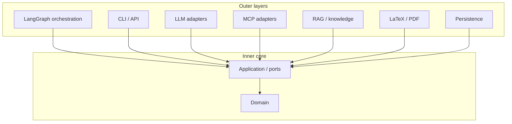
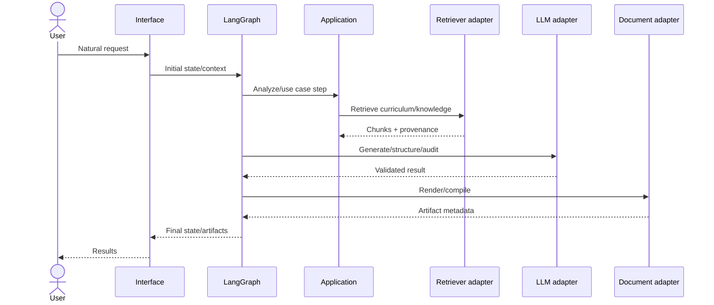

# Architecture

## Architectural style

Hermes Edu uses a pragmatic **Clean Architecture / Ports & Adapters** model.

Dependencies point inward. Concrete adapters implement abstract application ports.

## Dependency rules

### Domain may import
- Python standard library;
- domain sibling modules.

### Domain may not import
- LangGraph;
- MCP;
- OpenAI/provider SDKs;
- database drivers;
- HTTP frameworks;
- filesystem orchestration.

### Application may import
- domain;
- standard typing/protocol abstractions.

### Orchestration may import
- application;
- domain;
- LangGraph.

### Adapters may import
- application ports;
- domain models needed by the port contract;
- their external libraries.

### Bootstrap may import everything
It is the composition root and should contain wiring, not business decisions.

## Runtime flow

## State vs context

LangGraph state contains workflow-changing data: request interpretation, retrieval results, plan, draft, audit issues, outputs, counters. Runtime context contains immutable or run-scoped services/configuration such as provider registry, repositories, user/workspace identity, or settings.

Do not store service clients in serializable checkpoint state.

## Prompt placement

Canonical state stores structured/raw content, not giant formatted prompts. Prompt construction belongs near the model adapter/application service so templates may evolve without mutating stored business data.

## Subgraphs

The main graph routes to subgraphs. Course, TD, DM, DS, correction, and ingestion workflows should share application services but own their orchestration details.

## Failure model

Expected recoverable failures become structured state/errors and bounded retries. Programming errors should fail loudly. Long-running workflows use checkpoints. Irreversible actions must occur after approval and preferably in separate nodes.

## Framework replaceability

A future migration away from LangGraph, MCP, SQLite, or a provider must not require rewriting domain entities or use-case contracts.
