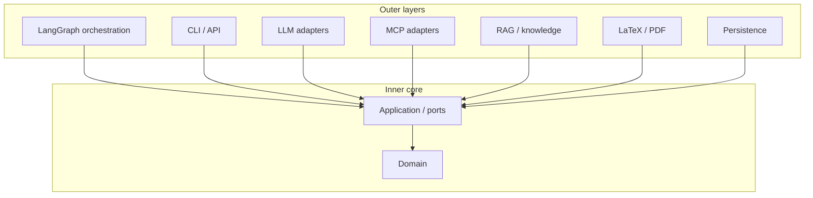
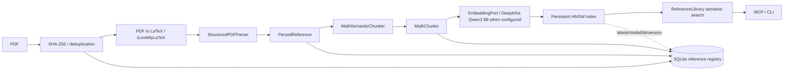
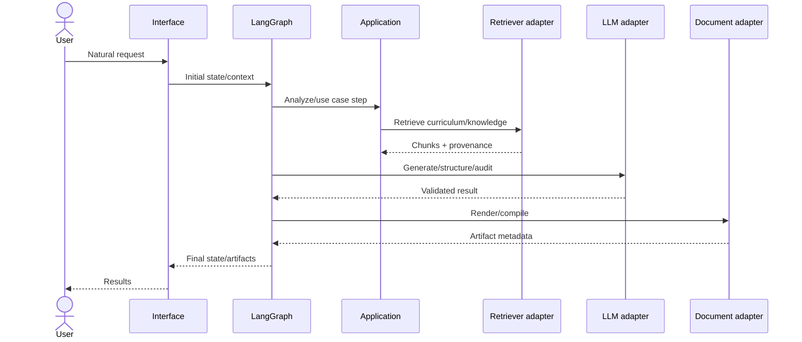
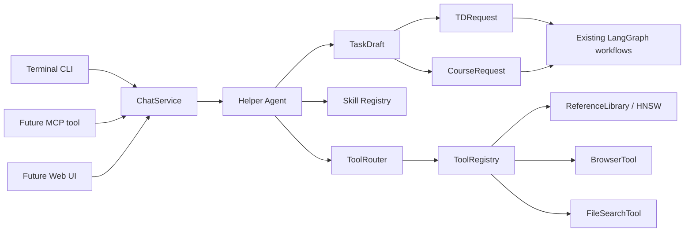
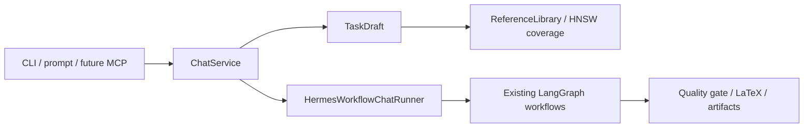
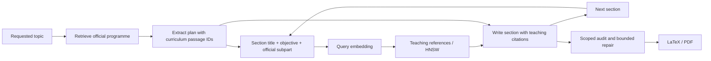

# Architecture

## Architectural style

Hermes Edu uses a pragmatic **Clean Architecture / Ports & Adapters** model.



Dependencies point inward. Concrete adapters implement abstract application ports.

## Personal reference library flow



The default `latex` mode converts every new PDF through the existing iLoveMyLaTeX adapter before semantic parsing/chunking. The conversion mode and adapter version participate in the parser fingerprint. `ParsedReference.source_latex` is persisted in the existing JSON cache; no SQL schema change is needed. An explicit `text` mode supports local/offline extraction. Conversion errors never silently select text mode. Existing indexed references remain searchable; adopting the new parser for an old reference requires import or explicit reindex, not an ordinary query.

`ReferenceLibrary` owns import, stage reuse, curation and search policies; it depends on file, parser, chunker, embedding, repository and vector ports. `bootstrap.py` wires the concrete adapters. SQLite is the source of truth for documents, parsed/chunk artifacts, status, relations and vector labels; HNSW files own the vectors and ANN structure. The two stores are checked together before a reference becomes `READY`. Fingerprints derive from the parser/OCR path, parser plus chunker configuration, and model/dimension/index version, so only invalidated stages are repeated. On a failed batch the status is `FAILED` or `OUTDATED`, while completed artifacts remain available for a retry. Existing TD retrieval keeps its separate SQLite JSON-vector path from ADR 0011.

## Dependency rules

### Domain may import
- Python standard library;
- domain sibling modules.

### Domain may not import
- LangGraph;
- MCP;
- OpenAI/provider SDKs;
- database drivers;
- HTTP frameworks;
- filesystem orchestration.

### Application may import
- domain;
- standard typing/protocol abstractions.

### Orchestration may import
- application;
- domain;
- LangGraph.

### Adapters may import
- application ports;
- domain models needed by the port contract;
- their external libraries.

### Bootstrap may import everything
It is the composition root and should contain wiring, not business decisions.

## Runtime flow



## Chat interface

`hermes-edu chat` and `hermes-edu prompt` are delivery adapters over a reusable
application service, not a parallel generation engine. The chat service now uses
a configurable Helper Agent as a conversational orchestrator. The Helper Agent is
an economical LLM role behind the existing provider port; it returns structured
decisions rather than free prose.



The chat layer stores compact structured state: `ChatSession`, turns,
`TaskDraft`, selected sources, pending questions, plan preview, recent compact
tool observations, a `SessionSummary`, agent metrics and produced artifacts. It
does not persist large prompts or provider clients. Slash commands and simple
controls (`/status`, `/plan`, `/sources`, `/add`, `/run`, `/cancel`) remain
deterministic fast paths without LLM calls.

Each agent step receives only a compact `AgentContext`: latest user message,
current draft, project context, session summary, recent observations, selected
tool schemas, selected skills and policy reminders. `ToolRouter` selects a small
subset of tools for the current turn so LaTeX, exam or browser capabilities are
not exposed when unrelated. `tools.discover` can return compact tool specs when
the helper needs additional discovery.

The helper returns an `AgentDecision`: `TOOL_CALL`, `TOOL_CALLS`,
`UPDATE_STATE`, `ASK_USER`, `DELEGATE`, `RESPOND` or `FINISH`. Hermes validates
and executes those decisions in a bounded loop controlled by
`HERMES_AGENT_MAX_STEPS`. Model output never executes directly: registry
allowlists, filesystem confinement, browser confirmation, reference policies,
workflow approval and quality gates remain deterministic code.

When the draft is ready, `ChatService` translates it to existing domain request
objects and the composition root runs the same checkpointed TD/course graph used
by `hermes-edu td` and `hermes-edu course`. Reference additions call
`ReferenceLibrary.import_pdf`; ingestion, deduplication, embeddings and HNSW
remain owned by the reference-library use case.

## State vs context

LangGraph state contains workflow-changing data: request interpretation, retrieval results, plan, draft, audit issues, outputs, counters. Runtime context contains immutable or run-scoped services/configuration such as provider registry, repositories, user/workspace identity, or settings.

Do not store service clients in serializable checkpoint state.

## Prompt placement

Canonical state stores structured/raw content, not giant formatted prompts. Prompt construction belongs near the model adapter/application service so templates may evolve without mutating stored business data.

## Subgraphs

The main graph routes to subgraphs. Course, TD, DM, DS, correction, and ingestion workflows should share application services but own their orchestration details.

## Failure model

Expected recoverable failures become structured state/errors and bounded retries. Programming errors should fail loudly. Long-running workflows use checkpoints. Irreversible actions must occur after approval and preferably in separate nodes.

## Framework replaceability

A future migration away from LangGraph, MCP, SQLite, or a provider must not require rewriting domain entities or use-case contracts.

## v0.1 concrete flow

The CLI and MCP server are delivery adapters. The composition root wires `CreateTD` to an LLM port, a retriever port and a document port. The main LangGraph graph validates/routes structured TD requests; its TD subgraph coordinates retrieval, planning, optional interrupt, generation, audit, targeted repair, rendering and compilation. No adapter client enters checkpoint state. SQLite checkpoint data is separate from the SQLite source/vector index. See ADRs 0011-0014 for the first-slice choices.

## Conversation interface

`hermes-edu chat` and `hermes-edu prompt` are interface adapters over the application layer, not independent generation workflows. Terminal input is translated by `ChatService` into a compact `ChatSession` and `TaskDraft`; the resulting ready task is executed by the existing course or TD workflows through `HermesWorkflowChatRunner`.



The chat service depends only on application ports: session repository, project context, reference library and task runner. `JSONChatSessionRepository` stores structured state under `HERMES_CHAT_SESSIONS_DIR`; it does not persist giant prompts. The intent parser applies only the latest user message to the existing draft and project context, so simple `/status`, `/plan`, `/sources`, `/add`, `/run` and numeric edits do not require an LLM call. A future MCP or web UI should call the same service methods instead of reimplementing conversation logic.

## Browser Tool

Interactive browsing is exposed as a Hermes tool, not as chat-specific logic:

```text
CLI / Chat / MCP
      ↓
BrowserService / BrowserTool
      ↓
BrowserPort
      ↓
PlaywrightBrowserAdapter
      ↓
Chromium
```

The domain/application contracts use `BrowserSession`, `PageSnapshot`,
`BrowserElementRef`, `DownloadedArtifact` and `BrowserTrace`. They do not import
Playwright. The adapter keeps Chromium sessions alive for a task and returns
compact observations with temporary element IDs (`e1`, `e2`, ...), visible text,
headings, links, buttons, inputs and selects. Full DOM/HTML is not sent to the
model.

Downloaded PDFs are handed to `ReferenceLibrary.import_pdf_bytes`, which reuses
the existing content hash, parser/chunker, embeddings and HNSW index.

## Course slice

`CreateCourse` depends on curriculum retrieval, reference search, LLM and course-document ports. `bootstrap.py` wires the existing SQLite programme store and the PDF HNSW library; query embedding precedes both searches. `orchestration/graphs/course.py` checkpoints plan approval, each section retrieval/generation, a draft TeX render before audit, scoped section audits, bounded targeted revision, and final render/compile. Course data stays immutable and framework independent. The course adapter renders escaped prose and an allowlisted math subset. See ADR 0016 and `docs/courses.md`; TD behavior remains separately tested.



`PlannedSection.curriculum_source_ids` ties each new section to the retrieved official subpart. Curriculum and teaching evidence have separate context budgets; only teaching chunk IDs are valid mathematical block citations. Section retrieval uses a 4 000 character query bound shared with the reference search boundary. The example-specific retrieval keeps a larger candidate pool, then a structured `select_examples` model call narrows those candidates to at most three examples using the general retrieval result and official basis. Checkpoints store official and teaching passages separately; legacy plans with no curriculum IDs use their saved programme context.

### Source fidelity and economical escalation

Retrieved references are the basis of course content, not citations added after free generation. The generation/revision instructions prohibit unsupported theorems, altered hypotheses, invented proofs and examples. Each section retains its retrieved passages and citations. Audits receive those teaching references as well as programme context; unsupported material must be removed or flagged as requiring additional evidence. These are grounding checks, not a formal entailment guarantee.

`TaskRoutedLLM` selects an ordered candidate list per task. `audit`, `revise`, `plan`, and `generate` may each receive at most four distinct configured alternatives, excluding their preferred model; `verify` inherits generation alternatives. Invalid output, timeout and provider failure advance through the bounded list, while revision offsets rotate its initial candidate. With fallbacks, each DeepSeek or DeepInfra candidate gets one transport and one empty-response attempt. The outcome store retains no prompts or completions, reports aggregate cost as unknown if any call is unknown, and does not alter routing. The course graph checkpoints each scoped audit and preserves other sections' findings. See ADR 0017.

### Quality gate

Course generation now ends with a deterministic `DocumentQualityGate` before the final result is returned. The gate consumes the approved plan, generated blocks, retained section references and internal provenance. It emits a machine-readable `quality_report.json` plus `quality_report.md` as workspace artifacts and sets `quality_status` to `PASS` or `DRAFT`. A blocker does not become student-facing prose: missing evidence, internal RAG comments, source metadata contamination, raw math outside `$...$`, notation switches such as `M_n(K)` to `M_n(R)`, exact duplicate blocks and selected elementary mathematical contradictions are reported in the quality report. The existing LLM audit remains the semantic review stage; the quality gate is provider-agnostic deterministic validation.

### Course transition wording

The optional course path `audit -> adapt_wording -> verify_wording -> render` uses a closed phrase policy saved in the checkpoint. Application-level selection returns validated edit spans and phrase indices; deterministic code preserves mathematical spans and all text outside the selected transitions. Only example/solution blocks are eligible. Semantic rejection stops before rendering. The default LLM port handles wording and verification; task-specific DeepInfra routing remains limited to mathematical audit/correction. See ADR 0018.
